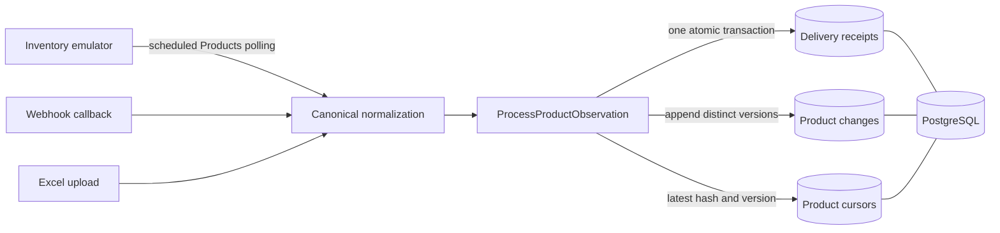

# Change Data Management Service

A Python prototype for capturing distinct product changes from a
VietFul-compatible inventory service. The project is being developed for the
kSynerX full-stack software development exercise.

> **Current status:** architecture scaffold only. The repository is not yet a
> working end-to-end prototype. Business logic, persistence, APIs, containers,
> and executable service tests remain to be implemented.

## Problem

The completed system should ingest product observations through three paths:

1. scheduled polling of a VietFul-compatible Products API;
2. webhook callbacks from the emulated inventory service; and
3. Excel files uploaded through the CDMS REST API.

Every path must produce the same canonical product representation. CDMS should
persist a new version only when business data changed, reject repeated
deliveries, and remain correct when requests are retried or processed
concurrently.

In this project, the assignment's "exactly once" requirement is interpreted as
**effectively-once database effects**. Networks can redeliver messages, so the
design relies on stable delivery identifiers, database constraints, and one
atomic transaction rather than assuming exactly-once transport.

## Current implementation status

| Area | Status | Current evidence |
| --- | --- | --- |
| Service/module boundaries | Scaffolded | Separate CDMS core, adapters, and inventory emulator packages |
| Canonical product model | Not implemented | Domain types contain TODO placeholders |
| Deterministic normalization and hashing | Not implemented | Function contracts exist; behavior does not |
| Idempotent change-processing use case | Not implemented | Transaction flow is specified but not executable |
| Faker inventory generation | Not implemented | Faker is pinned; factory behavior is still a stub |
| Polling, webhook, and Excel ingestion | Not implemented | Entry-point contracts exist only |
| PostgreSQL persistence and migrations | Not implemented | Adapter skeleton exists; no schema or migration exists |
| Containerized deployment | Not implemented | No Dockerfile or Compose definition exists |
| Automated service tests | Not implemented | Test files currently contain specifications only |
| Spike and concurrency tests | Not implemented | Deferred until correctness tests pass |

This table should be kept accurate as functionality is completed. A TODO file
or an interface is not counted as an implemented feature.

## Target architecture



All input adapters are intended to construct an
`IncomingProductObservation` and delegate to one central use case. That avoids
implementing different deduplication rules for polling, webhooks, and uploads.

The intended transaction is:

1. claim the source delivery identifier;
2. return `duplicate` when that delivery was already committed;
3. lock the current cursor for the product;
4. compare a deterministic hash of canonical business fields;
5. return `unchanged` when the content is identical;
6. append the next product version and update its cursor; and
7. commit the receipt, change, and cursor together.

This is a design contract, not a claim that the behavior currently works.

## Repository structure

```text
services/
├── cdms/
│   ├── src/cdms/
│   │   ├── domain.py          # Canonical product/change types
│   │   ├── normalization.py   # Source-to-domain mapping and hashing
│   │   ├── process_change.py  # Central idempotent use case
│   │   ├── polling.py         # Scheduled ingestion orchestration
│   │   ├── api.py             # Webhook, Excel, and query boundaries
│   │   └── adapters/          # VietFul, PostgreSQL, and Excel adapters
│   └── tests/
└── inventory-emulator/
    ├── src/inventory_emulator/
    │   ├── product_factory.py # Deterministic Faker data
    │   ├── store.py           # Mutable emulated source state
    │   ├── callbacks.py       # Callback delivery and failure modes
    │   └── api.py             # Required VietFul V1 Products subset
    └── tests/
```

Useful starting points are the
[canonical domain model](services/cdms/src/cdms/domain.py),
[change-processing use case](services/cdms/src/cdms/process_change.py), and
[emulator product factory](services/inventory-emulator/src/inventory_emulator/product_factory.py).

## Technology choices

| Component | Choice | Reason |
| --- | --- | --- |
| Application language | Python | Required by the exercise |
| Source-data generation | Faker | Reproducible inventory fixtures when seeded explicitly |
| Database | PostgreSQL | Required by the exercise; provides transactions, constraints, and row locks |
| API contract | VietFul V1 Products | The documented version that contains product operations |
| Deployment target | Single-machine containers | Required operating model for the prototype |

An HTTP framework, PostgreSQL driver, migration tool, and scheduler have not yet
been committed as project dependencies. They should be documented here only
after they are selected and added to a reproducible dependency manifest.

## Local development

### Prerequisites

- Python 3.14 or a deliberately selected supported Python version
- Git
- PostgreSQL and Docker with Compose support once persistence and containers
  are implemented

Clone the repository:

```bash
git clone https://github.com/nkhoi-01/cdms-ksynerx.git
cd cdms-ksynerx
```

Create isolated environments for the two application services:

```bash
python3 -m venv services/cdms/.venv
python3 -m venv services/inventory-emulator/.venv

services/inventory-emulator/.venv/bin/python -m pip install \
  -r services/inventory-emulator/requirements.txt
```

The CDMS service does not yet have a runtime dependency manifest. Both package
trees can currently be checked for Python syntax errors with:

```bash
services/cdms/.venv/bin/python -m compileall -q services/cdms/src
services/inventory-emulator/.venv/bin/python -m compileall -q \
  services/inventory-emulator/src
```

### Running the application

There is no valid application start command yet. Both service entry points
deliberately raise `NotImplementedError`. Run instructions will be added only
after the HTTP entry points, dependency manifests, database migrations, and
container definitions work from a clean checkout.

## Intended demonstration

The final prototype demonstration should show this observable sequence:

1. start PostgreSQL, the inventory emulator, and CDMS on one machine;
2. poll an initial product and observe change version 1;
3. poll the unchanged product again and observe no additional version;
4. mutate the product in the emulator;
5. poll again and observe exactly one version 2;
6. deliver the same webhook identifier more than once and observe one effect;
7. force a transaction failure and demonstrate rollback plus a successful retry;
8. run the correctness, concurrency, and spike tests.

This section describes the acceptance scenario; it is not currently executable.

## Testing

The repository currently has zero executable CDMS or emulator tests. Existing
test files contain test intentions, not assertions, and must not be presented
as a passing suite.

The minimum correctness suite should eventually prove:

- equivalent source records produce the same canonical hash;
- a changed business field produces a different hash;
- the first observation creates version 1;
- a repeated delivery identifier produces no second effect;
- unchanged content produces no second version;
- changed content produces exactly one next version;
- an exception rolls back the delivery receipt, change, and cursor together;
- concurrent duplicate submissions result in one committed change.

Exact test commands and measured results will be added after a test framework
and executable tests are committed.

## Design trade-offs

- **Effectively-once effects, not exactly-once transport:** retries are expected;
  correctness belongs in the database transaction and uniqueness constraints.
- **One central use case:** input adapters translate data but do not own change
  detection or deduplication rules.
- **Deterministic normalization before hashing:** transport timestamps, paging
  metadata, and unordered collection order must not create false changes.
- **Full normalized after-images for the first working version:** field-level
  deltas can be added later without weakening idempotency.
- **Database constraints over in-process memory:** Python sets and Faker's
  uniqueness helper cannot protect correctness across restarts or concurrency.
- **Narrow VietFul coverage:** only the V1 Products operations required by the
  demonstration should be emulated initially.

## Known unfinished work

- implement the canonical domain model and validation;
- implement V1 Product normalization and stable hashing;
- implement the in-memory correctness tests and central processing use case;
- implement the minimum VietFul-compatible emulator endpoints;
- add PostgreSQL schema migrations and transactional repositories;
- add polling and webhook ingestion;
- add a minimal product-change query API;
- add Dockerfiles and a Compose deployment;
- add failure, concurrency, and spike tests;
- decide whether Excel ingestion fits within the final delivery scope.

## Lessons learned so far

- A source delivery identifier and a product identifier solve different
  problems and must not be conflated.
- Duplicate delivery and unchanged business content are separate outcomes.
- Stable normalization is a prerequisite for meaningful content hashes.
- Delivery receipt insertion, version insertion, and cursor advancement must be
  one transaction to remain retry-safe.
- A small vertical slice with demonstrated failure behavior is more valuable
  than many disconnected, unfinished endpoints.

## AI assistance disclosure

AI tools have been used for requirement exploration, documentation extraction,
architecture discussion, the initial TODO-only module scaffold, local debugger
configuration, and this README's structure and first draft.

At the current revision, the service modules do not contain completed business
behavior. Candidate-authored implementation, tests, measured results, and
presentation conclusions must be identified as they are added. The candidate
remains responsible for reviewing, testing, understanding, and explaining every
submitted line.

## External references

- [VietFul API documentation](https://ext.stg.vnfai.com/doc/index.html)
- [VietFul V1 Products section](https://ext.stg.vnfai.com/doc/index.html#tag/Products)
- [Faker documentation](https://faker.readthedocs.io/en/master/)
- [PostgreSQL documentation](https://www.postgresql.org/docs/current/)
- [Docker Compose documentation](https://docs.docker.com/compose/)
